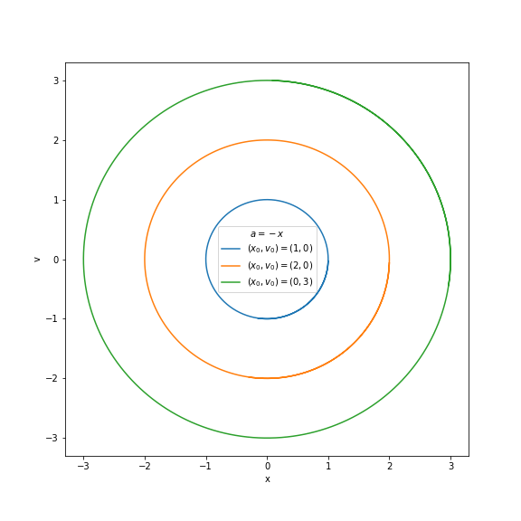

# Assignment 1 Solution
Physics 141/241: Computational Physics I

Instructor: Javier Duarte

Spring 2023

Due date for first version: Friday, April 21, 2023 8pm_

Due date for corrected version: Wednesday, April 26, 2023 8pm_

Total points: 110 [141], 150 [241]

## Problem 1 (141/241) [40 points]

(a) [10 points] Please see included code and figure below.

(b) [10 points] Please see included code and figure below.

(c) [10 points] Please see included code and movie below.

(d) [10 points] 3D plots are shown below for the two scenarios.

## Problem 2 (141/241) [20 points]
(a) [10 points] Please see included code.

(b) [10 points] A composite plot is shown below.

 

## Problem 3 (141/241) [30 points]
(a) [10 points] Yes, there appears to be a slight deterioration in the error behavior over the growing number of revolutions of the planets.

(b) [10 points] The plot for Earth is shown here

and for Mars is shown here

(c) [10 points] Animate Earth's motion in Matplotlib (or some other application of your choice) over many revolutions.

## Problem 4 (141/241) [20 points]
The leapfrog-verlet algorithm is given by

$$
\begin{align}
\vec{v}_{n+1/2} &= \vec{v}_{n} + \frac{1}{2}\Delta t \vec{a}_{n}\\
\vec{r}_{n+1} &= \vec{r}_{n} + \Delta t \vec{v}_{n+1/2}\\
\vec{v}_{n+1} &= \vec{v}_{n+1/2} + \frac{1}{2}\Delta t \vec{a}_{n+1}
\end{align}
$$

which means 

$$
\begin{align}
\vec{r}_{n+1} &= \vec{r}_{n} +\Delta t \vec{v}_{n} + \frac{1}{2}\Delta t^2 \vec{a}_{n}\\
\vec{v}_{n+1} &= \vec{v}_{n} + \frac{1}{2}\Delta t (\vec{a}_{n} +  \vec{a}_{n+1})
\end{align}
$$

In the Kepler problem, $\vec{a}_n = -k\vec{r}_n/r_n^3$ where $k$ is a constant.
The angular momentum in the $n$th time step is given by $\vec{L}_n = \vec{r}_n\times \vec{v}_n$. 
We will show that $\vec{L}_{n+1} - \vec{L}_n = 0$.
We can also use the fact that $\vec{r}_n\times\vec{r}_n=\vec{r}_n\times\vec{a}_n = \vec{v}_n\times \vec{v}_n = 0$ and $\vec{a}\times\vec{b} = -\vec{b}\times\vec{a}$.

$$
\begin{align}
\vec{L}_{n+1} - \vec{L}_{n}&= \vec{r}_{n+1}\times \vec{v}_{n+1} - \vec{r}_{n}\times \vec{v}_{n}\\
&= (\vec{r}_{n} +\Delta t \vec{v}_{n} + \frac{1}{2}\Delta t^2 \vec{a}_{n})\nonumber\\
&\times (\vec{v}_{n} + \frac{1}{2}\Delta t (\vec{a}_{n} +  \vec{a}_{n+1}))  - \vec{r}_{n}\times \vec{v}_{n}\\
& = \frac{1}{2}\Delta t\vec{r}_n \times \vec{a}_{n+1} + \frac{1}{2}\Delta t^2 \vec{v}_n \times \vec{a}_n \nonumber\\
&+ \frac{1}{2}\Delta t^2 \vec{v}_n \times \vec{a}_{n+1} + \frac{1}{2}\Delta t^2 \vec{a}_{n}\times \vec{v}_n + \frac{1}{4}\Delta t^3\vec{a}_n\times \vec{a}_{n+1}\\
&= \frac{1}{2}\Delta t\vec{r}_n \times (k\vec{r}_{n+1}/r_{n+1}^3) + \frac{1}{2}\Delta t^2 \vec{v}_n \times (k\vec{r}_{n+1}/r_{n+1}^3) \nonumber\\
&+ \frac{1}{4}\Delta t^3\vec{a}_n\times (k\vec{r}_{n+1}/r_{n+1}^3)\\
&= \frac{1}{2}\Delta t\vec{r}_n \times (k\Delta t \vec{v}_{n}/r_{n+1}^3) + \frac{1}{2}\Delta t^2 \vec{v}_n \times (k(\vec{r}_{n} + \frac{1}{2}\Delta t^2\vec{a}_{n})/r_{n+1}^3) \nonumber \\
&+ \frac{1}{4}\Delta t^3\vec{a}_n\times (k\Delta t \vec{v}_{n}/r_{n+1}^3)\\
&=  0 
\end{align}
$$

So angular momentum is conserved in the leapfrog algorithm exactly.

## Problem 5 (241 only) [20 points]
See included code and figure below.

## Problem 6 (241 only) [20 points]

See included code and figure below.

